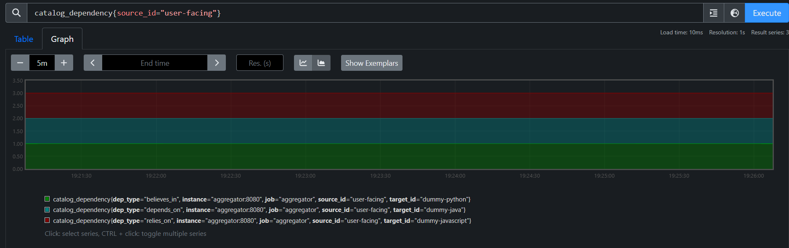
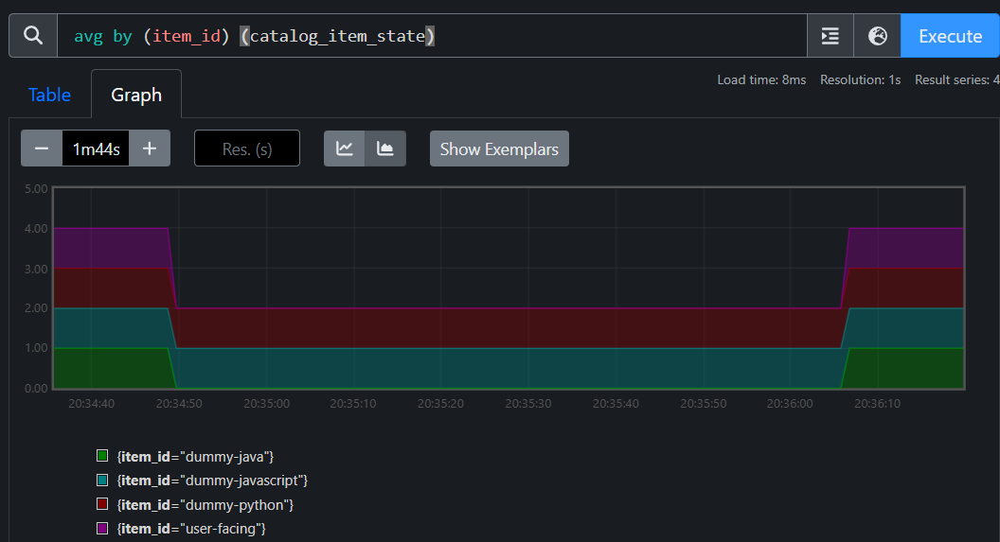
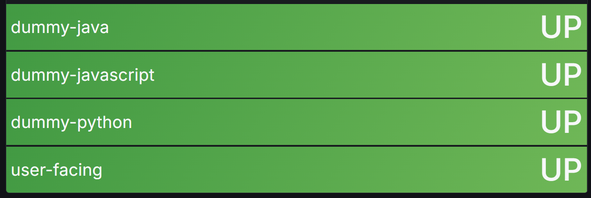
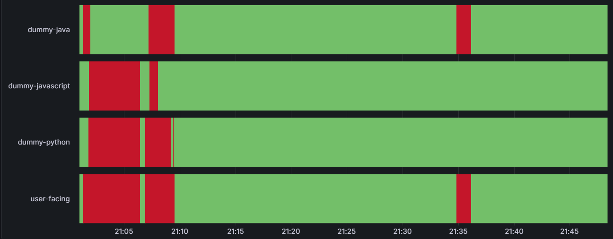

# Catalog health checks

This project demonstrates a simple approach to aggregating service-level health signals into a product-level health view
based on a static catalog definition.

The core idea is that the health state of an item composed of other items is derived deterministically from the states
of its dependencies. For example, a product consists of several services, and the overall product state is calculated
from the states of those services.

## Cloud Demo on AWS

Available on EC2 public instance, uses Grafana for visualization:

- https://alivion.cc/health-aggregator

Example dashboards:

- [Dashboard - Current state for "business_suite"](https://alivion.cc/health-aggregator/d/catalog-item-state-current/catalog-item-state-current?var-item_id=business-suite)
- [Dashboard - State timeline for "business_suite"](https://alivion.cc/health-aggregator/d/catalog-item-state-timeline/catalog-item-state-timeline?var-item_id=business-suite)

**Note:** A TLS certificate browser warning is expected because the certificate is self-signed.

For additional setup info, see  [README](deploy/demo/README.md).

## Architecture / Components

Major runtime components and responsibilities:

- **Aggregator service**: main Spring Boot application that loads the catalog, executes health checks, applies
  aggregation rules, and exposes health and metrics endpoints. Submodules:
- **Catalog loader**: reads the static catalog definition (`catalog.yaml` / `catalog.json`) and builds the in-memory
  dependency graph used for aggregation.
- **Health check runner**: executes configured checks (for example, HTTP checks) on a schedule and records raw
  health
  per catalog item.
- **Health aggregation rules**: deterministic rules that roll up child service states into product and service
  states.
- **Metrics / Actuator exporter**: publishes raw and aggregated states (including dependencies) via Spring Boot
  Actuator Prometheus metrics.
- **Dummy services**: local HTTP services that simulate external dependencies for development and testing. They are
  written in different languages (Java, JavaScript, Python). Each service exposes a `/health` endpoint and allows
  changing its state via `/set-health/{up|down}`.
- **Prometheus**: scrapes Actuator metrics and stores time-series data for local verification.
- **Grafana**: visualizes aggregated states and trends using dashboards backed by Prometheus.

Key data flow:

```
catalog + checks → raw health → aggregated health → metrics → dashboards
```

## Catalog

The catalog is a storage-agnostic domain model describing items and their relationships.

- **Item**: a catalog entry (for example, product or service) with a stable `ItemId`, name, and type.
- **Dependency**: a directed relationship between two items with an explicit string `type` (for example, "includes" or
  "depends on").

### Catalog configuration

The application loads a static catalog definition from the path configured by `catalog.path` (defaults to
`classpath:catalog.yaml`). Both YAML and JSON formats are supported.

See [config/demo/catalog.yaml](config/demo/catalog.yaml) for example.

### Demo catalog hierarchy

- Business Suite (`business-suite`, `business`)
  - Commerce Platform (`commerce-platform`, `product-family`)
    - Commerce Core (`commerce-core`, `product`)
      - Commerce Catalog Service (`commerce-catalog`, `service`)
      - Commerce Order Service (`commerce-order`, `service`)
      - Commerce Pricing Service (`commerce-pricing`, `service`)
    - Payments Suite (`payments-suite`, `product`)
      - Payments Gateway Service (`payments-gateway`, `service`)
      - Payments Ledger Service (`payments-ledger`, `service`)
      - Payments Risk Service (`payments-risk`, `service`)
  - Customer Experience (`customer-experience`, `product-family`)
    - Customer Engagement (`customer-engagement`, `product`)
      - Engagement Campaigns Service (`engagement-campaigns`, `service`)
      - Engagement Messaging Service (`engagement-messaging`, `service`)
      - Engagement Profile Service (`engagement-profile`, `service`)
    - Marketing Automation (`marketing-automation`, `product`)
      - Marketing Content Service (`marketing-content`, `service`)
      - Marketing Journeys Service (`marketing-journeys`, `service`)
      - Marketing Offers Service (`marketing-offers`, `service`)
  - Operations Suite (`operations-suite`, `product-family`)
    - Support Desk (`support-desk`, `product`)
      - Support Chat Service (`support-chat`, `service`)
      - Support Intake Service (`support-intake`, `service`)
      - Support SLA Service (`support-sla`, `service`)
    - Fulfillment Hub (`fulfillment-hub`, `product`)
      - Fulfillment Returns Service (`fulfillment-returns`, `service`)
      - Fulfillment Routing Service (`fulfillment-routing`, `service`)
      - Fulfillment Shipping Service (`fulfillment-shipping`, `service`)

## Health aggregation

The health state of a product or service that includes or depends on other items is derived deterministically from the
states of its dependencies.

The aggregator applies the following rules:

- If **any child service is `DOWN`**, the parent is `DOWN`.
- Otherwise, if **any child service is `UNKNOWN`**, the parent is `UNKNOWN`.
- The parent is `UP` **only if all child services are `UP`**.
- Products without child services default to `UNKNOWN` to avoid false positives.

## Health check configuration

Health checks are configured separately from the catalog definition. The default configuration file is
`classpath:health-checks.yaml` and can be overridden via the `health.checks-path` property. Each check entry is mapped
to a catalog item and defines the HTTP request to run on a polling interval. The demo stack uses external config files;
see [config/demo/health-checks.yaml](config/demo/health-checks.yaml) for an annotated example.

## Limitations & Next Steps

This is a proof-of-concept (PoC). It is designed to demonstrate deterministic health aggregation and its inherent
constraints.

### Current limitations (PoC scope)

- **Static catalog only**: the catalog is loaded from a static YAML or JSON file at startup; there is no dynamic catalog
  source, synchronization, or runtime updates.
- **Limited check types**: health checks are currently focused on basic HTTP checks.
- **Local-only stack**: the Compose stack assumes a local network and dummy services.
- **No persistence**: aggregated state is emitted as metrics only.
- **No authentication or authorization**: endpoints and dashboards are exposed without auth.

### Next possible steps

- **Dynamic catalog source**
- **Expanded health check types**
- **Alerting and incident flow**
- **Historical storage**
- **Authentication and RBAC**

## Prometheus metrics

The application exports current catalog item health via Spring Boot Actuator at:

```
/actuator/prometheus
```

Aggregation metrics are:

```
catalog_item_state
catalog_dependency
```

Metric names, labels, and semantics are documented in
[HealthMetricsDocumentation.java](src/main/java/com/github/vermucht/aggregator/export/HealthMetricsDocumentation.java)

See [Screenshots](#screenshots) for images.

## Grafana visualization

Grafana is available at:

```
http://localhost:3000
```

See [Screenshots](#screenshots) for images.

## Dummy services

Each dummy service exposes:

- `GET /health`
- `GET /set-health/{up|down}`

## Local startup

```bash
make up
```

## Using Local Demo

This section describes the minimal end-to-end flow to run the PoC and reproduce the screenshots shown below.

1. Start the stack:

   ```bash
   make up
   ```

2. Check that the dummy services are running and returning their `/health` endpoints:

   ```
   http://localhost:8081/health
   http://localhost:8082/health
   http://localhost:8083/health
   ```

3. Verify that the aggregator exposes Prometheus metrics for item health and dependencies:

   ```
   http://localhost:8080/actuator/health
   ```

   Example output (truncated):

   ```
   # HELP catalog_item_state Current health of a catalog item (1=UP, 0.5=UNKNOWN, 0=DOWN)
   # TYPE catalog_item_state gauge
   catalog_item_state{item_id="dummy-java",item_name="Dummy Java service",item_type="service"} 1.0
   catalog_item_state{item_id="dummy-javascript",item_name="Dummy JavaScript gateway",item_type="gateway"} 1.0
   catalog_item_state{item_id="dummy-python",item_name="Dummy Python database",item_type="database"} 1.0
   catalog_item_state{item_id="user-facing",item_name="User facing service",item_type="product"} 1.0
   ```

   Note: `user-facing` is not a running container. Its state is derived solely from the states of its dependency
   services.

   Dependency edges are exported as a separate metric:

   ```
   # HELP catalog_dependency Catalog dependency edge (1=present)
   # TYPE catalog_dependency gauge
   catalog_dependency{dep_type="relies_on",source_id="user-facing",target_id="dummy-javascript"} 1.0
   catalog_dependency{dep_type="believes_in",source_id="user-facing",target_id="dummy-python"} 1.0
   catalog_dependency{dep_type="depends_on",source_id="user-facing",target_id="dummy-java"} 1.0
   ```

4. Flip a dummy service state to simulate an incident:

   ```
   http://localhost:8081/set-health/down
   ```

   Optionally restore it:

   ```
   http://localhost:8081/set-health/up
   ```

5. Observe propagated changes:

- **Actuator**: `http://localhost:8080/actuator/health`
- **Prometheus UI**: `http://localhost:9090`
    * Item health:
      [open query](http://localhost:9090/graph?g0.expr=avg%20by%20%28item_id%29%20%28catalog_item_state%29&g0.tab=0&g0.range_input=15m)
    * Dependency edges:
      [open query](http://localhost:9090/graph?g0.expr=avg%20by%20%28target_id%2Csource_id%29%20%28catalog_dependency%29&g0.tab=0&g0.range_input=15m)
- **Grafana UI**: `http://localhost:3000`
    * Current state dashboard:
      [open dashboard](http://localhost:3000/d/catalog-item-state-current?var-item_id=user-facing&var-deps=$__all)
    * Timeline dashboard:
      [open dashboard](http://localhost:3000/d/catalog-item-state-timeline?var-item_id=user-facing&var-deps=$__all)

### Screenshots

#### Prometheus - Catalog Dependency Graph



#### Prometheus - Catalog Item State



#### Grafana - Current Catalog Item State



#### Grafana - Catalog Item State Timeline


