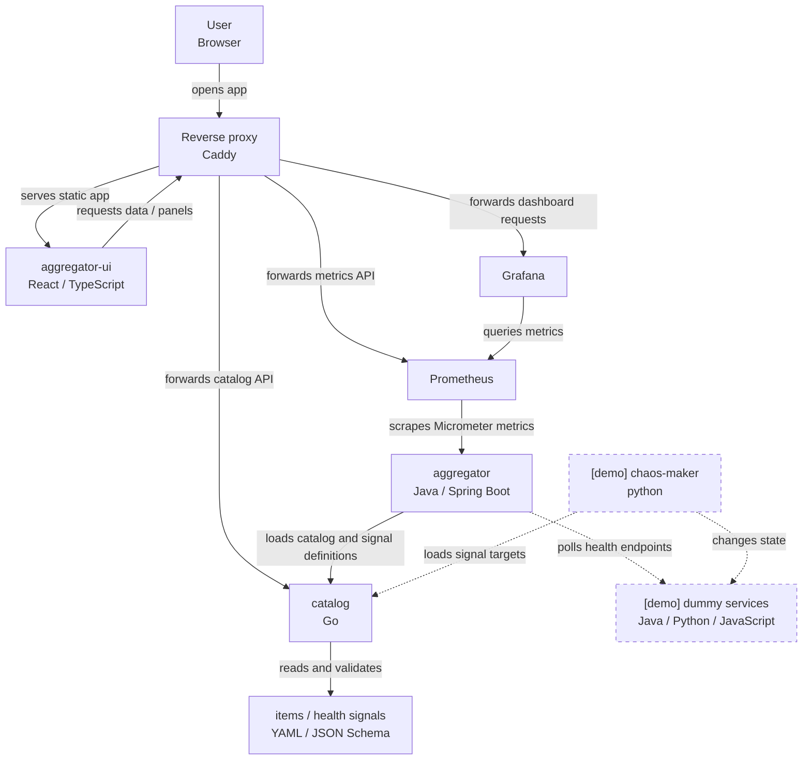

# Catalog Health Aggregator

Catalog Health Aggregator shows how failures in technical services affect
user-facing products and helps explain why a product is unhealthy.

It does this by translating service-level health signals into an explainable
product-level view.

This is a pet project I work on in my free time.

---

## Try the live demo

Open the live demo: https://aggregator.alivion.cc

The demo changes automatically: sample services periodically fail and recover,
making their impact visible across products and dependencies.

What to look at:

- The dependency tree on the left shows the current health of products,
  services, and shared components.
- Select any item to inspect its health signals and dependencies, see who owns
  it, and find the available contact channels.
- On a `DOWN` item, the `Affecting now` section shows the signals currently
  responsible for its state and separates its own failed checks from failures
  inherited from dependencies.
- Select an affected dependency to jump directly to its details, even when it
  is several levels below the product in the dependency tree.
- The timeline and dashboards show recent state changes, Prometheus metrics,
  and Grafana panels.

---

## What problem it solves

Monitoring normally reports the health of individual technical components.
Users and product owners, however, experience problems at the product level.

The aggregator connects these two views. It combines service-level signals with
a catalog of products, dependencies, and ownership, then propagates health
through the dependency graph.

For example, if a shared authentication service fails, several products may
become unavailable at once. The aggregator shows the affected products while
keeping the shared dependency visible as the likely source of the problem.

The goal is to answer not only "which service is unhealthy?", but also "what is
broken for users, what depends on it, and where is the likely root cause?"

---

## How it works



The `catalog` service owns the contract: items, dependencies, contacts, actors,
and signal definitions. The `aggregator` consumes that contract, polls configured
HTTP health endpoints, computes item health through the dependency graph, and
exports the result as metrics. The UI reaches catalog, Prometheus, and Grafana
through the Caddy reverse proxy, combining catalog structure with current
Prometheus data and Grafana panels.

The demo services are not part of the core design. They are replaceable signal
sources that make the public demo change over time.

### Health propagation rules

Health propagation is deterministic:

- Severity is ordered as `DOWN > UNKNOWN > UP`.
- An item without dependencies uses its own signal state only.
- For an item with dependencies, its own `DOWN` state dominates. If its own state
  is `UP` or `UNKNOWN`, the item state is derived from dependencies: `DOWN` if
  any dependency is down, `UNKNOWN` if any dependency is unknown, and `UP` when
  all dependencies are up.

---

## Why so many technologies?

Partly because it is more interesting than a single-stack toy app, but also
because it mirrors a real company with history. Different teams know different
stacks, services appear at different times, and ownership boundaries outlive
framework choices. A useful platform should still work across those differences.

That is why the repository has a Java backend, a Go catalog service, a React UI,
Python demo automation, Java/Python/JavaScript dummy services, Prometheus,
Grafana, Caddy, Docker Compose, and shared QA tooling. The important boundary is
not the language. It is the contract between services.

---

## Run it locally

You need Docker or Podman with Compose support. From the repository root:

```shell
make up
```

Then open:

```text
http://localhost:3000
```

Stop the stack with:

```shell
make down
```

First startup can take a while because Compose builds local service images and
downloads Prometheus/Grafana/Caddy images. Full local-run options are in
[docs/running-locally.md](docs/running-locally.md).

---

## Repository map

- [services-core/aggregator](services-core/aggregator): Java / Spring Boot
  backend. Loads catalog and signal definitions, polls health endpoints,
  propagates health through the dependency graph, and exposes metrics.
- [services-core/catalog](services-core/catalog): Go service. Owns catalog
  files, JSON schemas, validation, and the catalog HTTP API.
- [services-core/aggregator-ui](services-core/aggregator-ui): React frontend
  served by Caddy.
- [services-extra/prometheus](services-extra/prometheus): metrics collection.
- [services-extra/grafana](services-extra/grafana): dashboards used by the UI.
- [services-demo/chaos-maker](services-demo/chaos-maker): Python service that
  changes demo-service state.
- [services-demo/dummy-java](services-demo/dummy-java),
  [services-demo/dummy-python](services-demo/dummy-python), and
  [services-demo/dummy-javascript](services-demo/dummy-javascript): simulated
  services with health endpoints.

More detail:

- [docs/services.md](docs/services.md) explains the service responsibilities,
  contracts, catalog files, and metrics.
- [docs/development.md](docs/development.md) covers formatting, linting, and git
  hooks.
- [deploy/demo/README.md](deploy/demo/README.md) covers the hosted demo stack.
