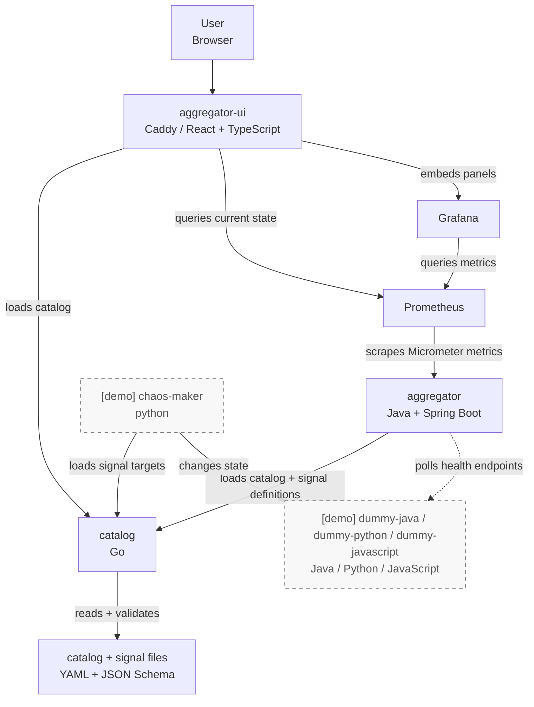

# Catalog Health Aggregator

Open the live demo: https://aggregator.alivion.cc

Catalog Health Aggregator turns low-level service health signals into a
product-level view of customer impact. The goal is to answer a practical
incident question faster: not only "which service is unhealthy?", but "what is
broken for users, what depends on it, and where is the likely root cause?"

This is a pet project I work on in my free time.

---

### System at a glance



The `catalog` service owns the contract: items, dependencies, contacts, actors,
and signal definitions. The `aggregator` consumes that contract, polls configured
HTTP health endpoints, computes item health through the dependency graph, and
exports the result as metrics. The UI combines catalog structure with current
Prometheus data and Grafana panels.

The demo services are not part of the core design. They are replaceable signal
sources that make the public demo change over time.

Health propagation is deterministic. Severity is ordered as
`DOWN > UNKNOWN > UP`; a dependent item becomes `DOWN` if any dependency is
down, `UNKNOWN` if the state cannot be proven healthy, and `UP` only when its
own signals and dependencies are healthy.

---

### Why so many technologies?

Partly because it is more interesting than a single-stack toy app, but also
because it mirrors a real company with history. Different teams know different
stacks, services appear at different times, and ownership boundaries outlive
framework choices. A useful platform should still work across those differences.

That is why the repository has a Java backend, a Go catalog service, a React UI,
Python demo automation, Java/Python/JavaScript dummy services, Prometheus,
Grafana, Caddy, Docker Compose, and shared QA tooling. The important boundary is
not the language. It is the contract between services.

---

### What to look at in the demo

The demo catalog contains product families, products, services, shared technical
dependencies, owners, and health signals. `chaos-maker` periodically breaks and
restores demo services so impact is visible without manual setup.

- Left side: dependency tree with current health state.
- Details panel: selected item, own signals, impacted dependencies, owners, and
  related context.
- Timeline and dashboards: recent state changes and Prometheus/Grafana views for
  the selected item.

---

### Run it locally

You need Docker or Podman with Compose support. From the repository root:

```shell
make up
```

Then open:

```text
http://localhost:3000
```

Stop the stack with:

```shell
make down
```

First startup can take a while because Compose builds local service images and
downloads Prometheus/Grafana/Caddy images. Full local-run options are in
[docs/running-locally.md](docs/running-locally.md).

---

### Repository map

- [services-core/aggregator](services-core/aggregator): Java / Spring Boot
  backend. Loads catalog and signal definitions, polls health endpoints,
  propagates health through the dependency graph, and exposes metrics.
- [services-core/catalog](services-core/catalog): Go service. Owns catalog
  files, JSON schemas, validation, and the catalog HTTP API.
- [services-core/aggregator-ui](services-core/aggregator-ui): React frontend
  served by Caddy.
- [services-extra/prometheus](services-extra/prometheus): metrics collection.
- [services-extra/grafana](services-extra/grafana): dashboards used by the UI.
- [services-demo/chaos-maker](services-demo/chaos-maker): Python service that
  changes demo-service state.
- [services-demo/dummy-java](services-demo/dummy-java),
  [services-demo/dummy-python](services-demo/dummy-python), and
  [services-demo/dummy-javascript](services-demo/dummy-javascript): simulated
  services with health endpoints.

More detail:

- [docs/services.md](docs/services.md) explains the service responsibilities,
  contracts, catalog files, and metrics.
- [docs/development.md](docs/development.md) covers formatting, linting, and git
  hooks.
- [deploy/demo/README.md](deploy/demo/README.md) covers the hosted demo stack.
