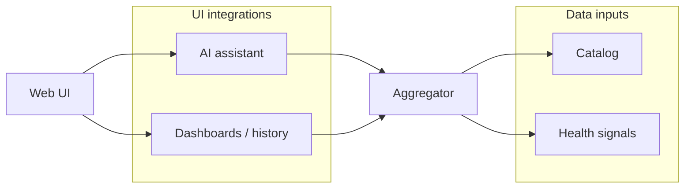

# Catalog Health Aggregator

Catalog Health Aggregator shows how failures in technical services affect
user-facing products and helps explain why a product is unhealthy.

It does this by translating service-level health signals into an explainable
product-level view.

This is a pet project I work on in my free time.

---

## Try the live demo

Open the live demo: https://aggregator.alivion.cc

The demo changes automatically: sample services periodically fail and recover,
making their impact visible across products and dependencies.

The catalog tree and item headers use these health indicators:

-  **UP** - Working normally.
-  **DOWN** - This item or a service it needs has a problem.
-  **UNKNOWN** - Aggregator is reachable, but it does not have enough information to determine health.
  Product Health states above are computed by Aggregator, not by the browser.
  When the UI loses its connection to Aggregator, it shows a gray
  **⊘ DISCONNECTED** banner with the last successful update and the detected
  connection-loss time. Previous Product Health states and signals remain
  visible as **Last known** rather than being changed to UNKNOWN or DOWN.
  If the UI has never received a successful health response, no Item health
  states are displayed until one arrives.

What to look at:

- The dependency tree on the left shows the current health of products,
  services, and shared components.
- Select any item to inspect its health signals and dependencies, see who owns
  it, and find the available contact channels.
- The `Unhealthy signals` section shows affected checks on the item and its
  dependencies, helping you trace where a problem comes from.
- Select an affected dependency to jump directly to its details, even when it
  is several levels below the product in the dependency tree.
- The `Timeline` shows health history, including dependency impact. Change the
  time range or filter checks to explore what happened.
- Use the help buttons beside section titles for short explanations and
  animated examples.

---

## What problem it solves

Monitoring normally reports the health of individual technical components.
Users and product owners, however, experience problems at the product level.

The aggregator connects these two views. It combines service-level signals with
a catalog of products, dependencies, and ownership, then propagates health
through the dependency graph.

For example, if a shared authentication service fails, several products may
become unavailable at once. The aggregator shows the affected products while
keeping the shared dependency visible as the likely source of the problem.

The goal is to answer not only "which service is unhealthy?", but also "what is
broken for users, what depends on it, and where is the likely root cause?"

---

## How it works

At a high level, the system combines service-level signals with catalog
relationships, computes health deterministically, and exposes that state
through the UI, dashboards, and an optional AI assistant.


```mermaid
flowchart LR
  ui["Web UI"]

  subgraph experience["UI integrations"]
    direction TB
    agent["AI assistant"]
    dashboards["Dashboards / history"]
  end

  ui --> agent
  ui --> dashboards

  aggregator["Aggregator"]

  subgraph inputs["Data inputs"]
    direction TB
    catalog["Catalog"]
    signals["Health signals"]
  end

  agent --> aggregator
  dashboards --> aggregator

  aggregator --> catalog
  aggregator --> signals
```

The LLM is not part of health calculation. Health state is derived from
catalog relationships and service signals before any AI interaction happens.

For detailed data flow, AI interaction, and runtime service topology, see
[Services and architecture](docs/services.md).

### Health propagation rules

Health propagation is deterministic:

- Severity is ordered as `DOWN > UNKNOWN > UP`.
- An item without dependencies uses its own signal state only.
- For an item with dependencies, its own `DOWN` state dominates. If its own state
  is `UP` or `UNKNOWN`, the item state is derived from dependencies: `DOWN` if
  any dependency is down, `UNKNOWN` if any dependency is unknown, and `UP` when
  all dependencies are up.

---

## Why so many technologies?

Partly because it is more interesting than a single-stack toy app, but also
because it mirrors a real company with history. Different teams know different
stacks, services appear at different times, and ownership boundaries outlive
framework choices. A useful platform should still work across those differences.

That is why the repository has a Java backend, a Go catalog service, a React UI,
Python demo automation, Java/Python/JavaScript dummy services, Prometheus,
Grafana, Caddy, Docker Compose, and shared QA tooling. The important boundary is
not the language. It is the contract between services.

---

## Run it locally

You need Docker or Podman with Compose support. From the repository root:

```shell
make up
```

Then open:

```text
http://localhost:3000
```

Stop the stack with:

```shell
make down
```

First startup can take a while because Compose builds local service images and
downloads Prometheus/Grafana/Caddy images. Full local-run options are in
[docs/running-locally.md](docs/running-locally.md).

### Optional AI agent configuration

Local Docker Compose environments enable the Bedrock AI agent with
non-secret defaults from `compose/compose.overlay.local-ports.yaml`.
Other developers can override `AGENT_AI_CONFIG` from their shell and provide
temporary credentials from their own AWS profile, with access to their chosen
Bedrock model. The project `aggregator-admin` profile is not required.
The current AI agent implements the Bedrock provider only.
The base Compose stack leaves AI disabled unless configured.

For the PowerShell login, credential refresh, and security notes, see
[docs/running-locally.md](docs/running-locally.md#optional-ai-agent).

For deployment on EC2, omit `api_key` and explicit AWS credentials so boto3
uses the instance IAM role.

---

## Repository map

- [services-core/aggregator](services-core/aggregator): Java / Spring Boot
  backend. Loads catalog and signal definitions, polls health endpoints,
  propagates health through the dependency graph, exposes current health facts,
  and exports derived metrics.
- [services-core/ai-agent](services-core/ai-agent): optional Python service that
  answers natural-language health questions by calling the aggregator REST API
  and using a configured model provider.
- [services-core/catalog](services-core/catalog): Go service. Owns catalog
  files, JSON schemas, validation, and the catalog HTTP API.
- [services-core/aggregator-ui](services-core/aggregator-ui): React frontend
  served by Caddy.
- [services-extra/prometheus](services-extra/prometheus): metrics collection.
- [services-extra/grafana](services-extra/grafana): dashboards used by the UI.
- [services-demo/chaos-maker](services-demo/chaos-maker): Python service that
  changes demo-service state.
- [services-demo/dummy-java](services-demo/dummy-java),
  [services-demo/dummy-python](services-demo/dummy-python), and
  [services-demo/dummy-javascript](services-demo/dummy-javascript): simulated
  services with health endpoints.

More detail:

- [docs/services.md](docs/services.md) contains detailed architecture and
  interaction diagrams.
- [docs/development.md](docs/development.md) covers formatting, linting, and git
  hooks.
- [deploy/demo/README.md](deploy/demo/README.md) covers the hosted demo stack.
- [infra/bootstrap/README.md](infra/bootstrap/README.md) documents project IAM
  administration. [deploy/infra/README.md](deploy/infra/README.md) explains
  workload infrastructure, state separation, and safe operational boundaries.
- [tools/code_qa/README.md](tools/code_qa/README.md) describes the repository
  QA runner and available module-level checks.
