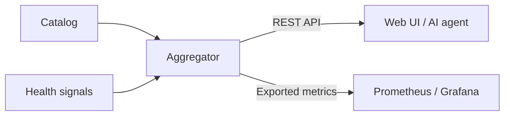
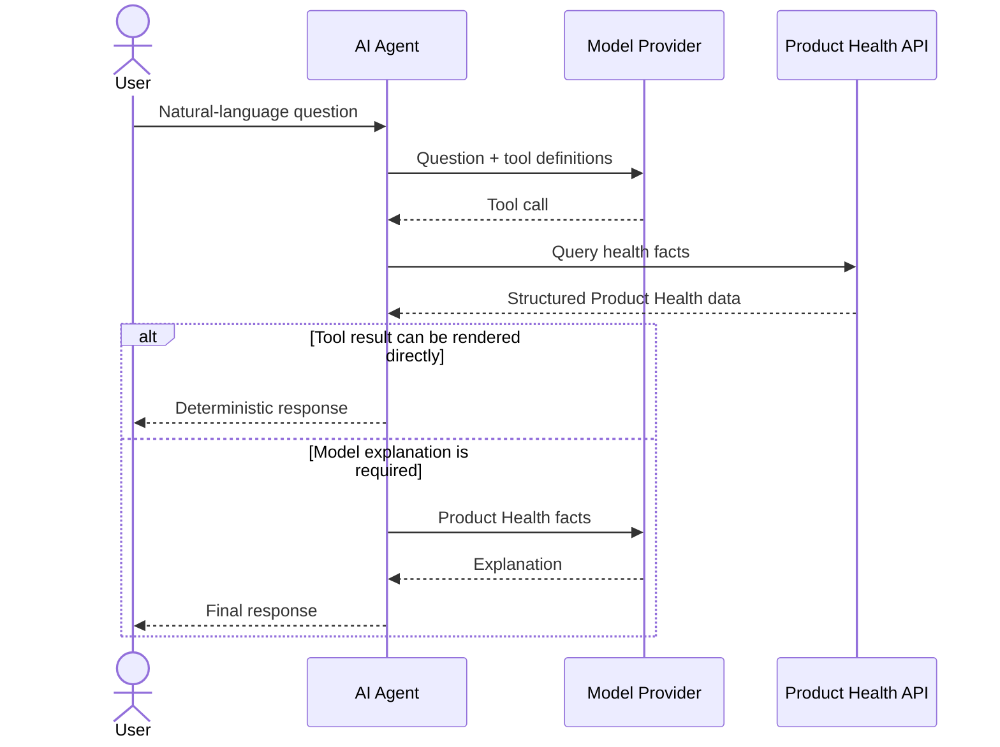

# Services and architecture

Detailed architecture views for Catalog Health Aggregator. Service locations and short descriptions are kept in the main README.

## Product Health data flow

This view shows how the deterministic Product Health state is built and exposed.
The aggregator combines catalog data with health signals, then publishes the
same state through REST for application consumers and as metrics for
observability.

## AI-assisted investigation flow

This sequence shows how a user question moves through the optional AI path. The
model selects which Product Health data is needed, the agent retrieves the
deterministic facts, and the result is either rendered directly or sent back to
the model for explanation. The model does not calculate Product Health.

## Detailed service topology

This is the runtime topology of the demo stack. Caddy is the entry point, with
the Web UI, catalog, aggregator, and optional AI agent forming the core
application. Prometheus and Grafana provide observability, while the demo-only
services generate changing health states.

The catalog reads the file-backed definitions, the aggregator consumes the
catalog and polls service health, and the AI agent queries the aggregator and
optionally calls an external model provider.

