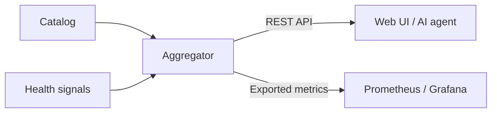
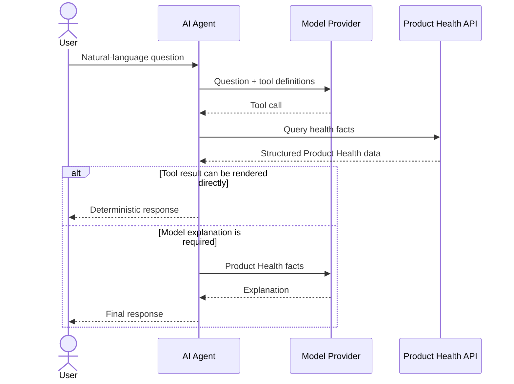

# Services and architecture

Detailed architecture views for Catalog Health Aggregator. Service locations and short descriptions are kept in the main README.

## Product Health data flow

Both the REST API and exported metrics are derived from the same deterministic
Product Health state.

## AI-assisted investigation flow

The AI assistant can render structured tool results directly or use the model
again when an explanation is needed. It does not calculate Product Health.

## Detailed service topology

