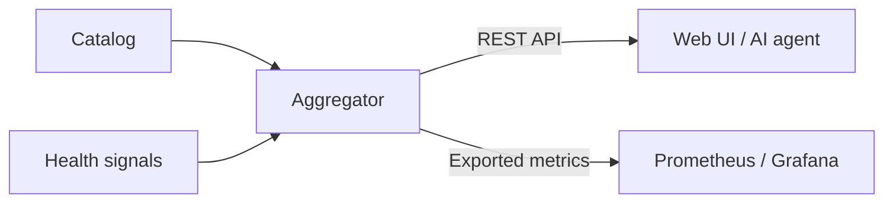
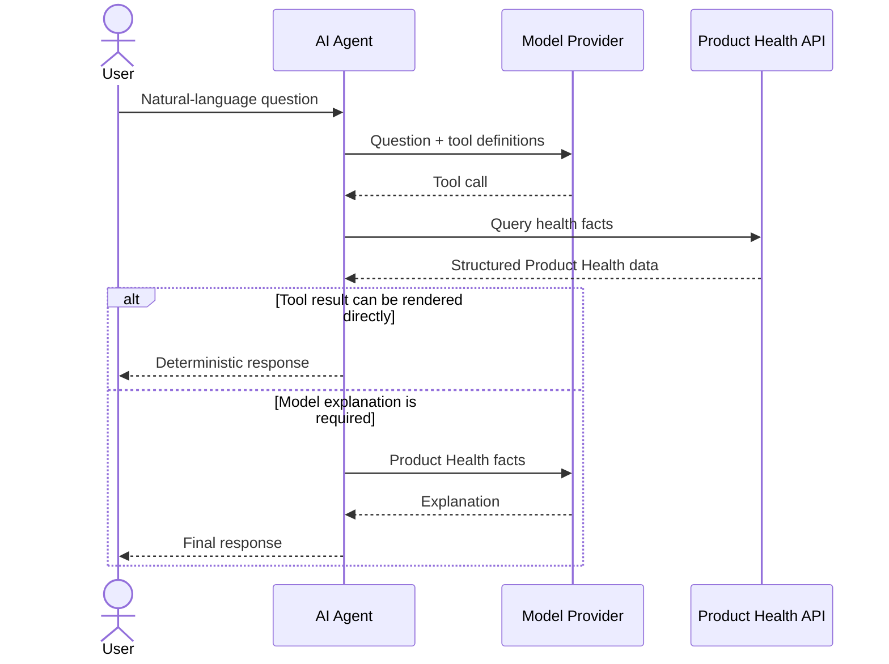

# Services and architecture

Detailed architecture views and service-level reference for Catalog Health Aggregator.

## Product Health data flow

Both the REST API and exported metrics are derived from the same deterministic
Product Health state.

## AI-assisted investigation flow

The AI assistant can render structured tool results directly or use the model
again when an explanation is needed. It does not calculate Product Health.

## Detailed service topology

## Core services

### `services-core/catalog`

Go service that owns catalog data and signal definitions.

It serves file-backed definitions from the active catalog directory selected by
`CATALOG_DIR`, for example `./catalog/demo` or `./catalog/empty`.

Important files:

- `catalog-items.yaml`: catalog items with stable IDs and human-readable titles.
- `catalog-dependencies.yaml`: dependency edges with `sourceId` and `targetId`.
- `signals-http-poll.yaml`: HTTP health endpoints polled by the aggregator.
- `catalog-contacts.yaml`, `catalog-item-contacts.yaml`, `catalog-actors.yaml`,
  `catalog-item-actors.yaml`, and `catalog-actors-contacts.yaml`: ownership and
  contact context used by the UI.
- `schemas/*.schema.yaml`: validation schemas for catalog files.

The service validates files at startup and exposes them through `/api/...`
endpoints. It also exposes `/health` for container health checks.

### `services-core/aggregator`

Java / Spring Boot backend that consumes the catalog API and signal definitions.

Responsibilities:

- Load catalog items, dependencies, and HTTP polling signal definitions.
- Poll configured service health endpoints.
- Convert raw signal responses into `UP`, `DOWN`, or `UNKNOWN`.
- Propagate state through the dependency graph with deterministic ordering:
  `DOWN > UNKNOWN > UP`.
- Expose current Product Health facts at `/api/product-health/*`.
- Expose Prometheus metrics at `/actuator/prometheus` derived from the Product
  Health query boundary.
- Store feedback submitted from the UI when configured.

Important metric names:

- `catalog_item_state`: aggregated item state.
- `catalog_item_own_state`: raw own state for items with configured signals.
- `catalog_item_signal_state`: state of an individual signal.
- `catalog_dependency`: dependency edge presence and depth.

Gauge values are `1.0` for `UP`, `0.5` for `UNKNOWN`, and `0.0` for `DOWN`.
Prometheus is an observability representation, not the canonical application API
for current Product Health state.

Current Product Health REST endpoints:

- `GET /api/product-health/items`: returns deterministic health facts for all
  catalog items. Pass `unhealthyOnly=true` to return only non-`UP` items.
- `GET /api/product-health/items/{itemId}`: exact lookup by catalog item id.
- `GET /api/product-health/search?query=...`: case-insensitive search by item
  id or display title. It returns a single item when exactly one match is found,
  or structured candidates when the query is ambiguous.

### `services-core/ai-agent`

Optional Python service that answers simple natural-language Product Health
questions such as "Why is Checkout down?" or "What is broken right now?"

Responsibilities:

- Accept questions at `/api/agent/ask`.
- Retrieve deterministic facts from the aggregator's Product Health REST API.
- Use a configured model provider to explain those facts.

The agent does not calculate product or service health. Its Product Health tool
adapter is REST-backed in this iteration and can later be replaced by an
MCP-backed adapter without changing the agent orchestration.

### `services-core/aggregator-ui`

React UI served by Caddy.

Responsibilities:

- Load catalog data through the `/catalog/*` reverse proxy path.
- Query the Product Health REST API for current item and signal state.
- Embed Grafana panels for deeper metric inspection.
- Show dependency impact, contacts, actors, signal history, and feedback entry
  points.

The service Caddyfile also proxies:

- `/api/feedback` and `/api/admin/feedback` to the aggregator.
- `/api/product-health/*` to the aggregator.
- `/api/agent/*` to the optional Python AI agent.
- `/grafana/*` to Grafana.
- `/prometheus/*` to Prometheus.

## Supporting services

### `services-extra/prometheus`

Prometheus scrapes the aggregator's `/actuator/prometheus` endpoint and stores
recent metric history. Local demo retention is intentionally small; hosted demo
retention is longer.

### `services-extra/grafana`

Grafana is provisioned with Prometheus as a data source and dashboards from
`services-extra/grafana/dashboards`. The UI embeds panels for the selected
catalog item.

## Demo services

### `services-demo/chaos-maker`

Python service that reads HTTP polling signal targets from the catalog API and
periodically changes dummy-service state. This keeps the demo moving without
manual failure injection.

### `services-demo/dummy-*`

Simulated services implemented in Java, Python, and JavaScript. They expose
health endpoints for aggregator polling and state-change endpoints used by
chaos-maker.

The mix is deliberate: the project demonstrates that catalog, signal, and
metric contracts can work across different service stacks.
