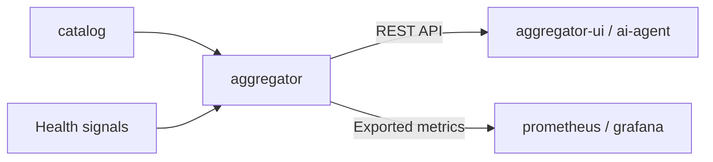
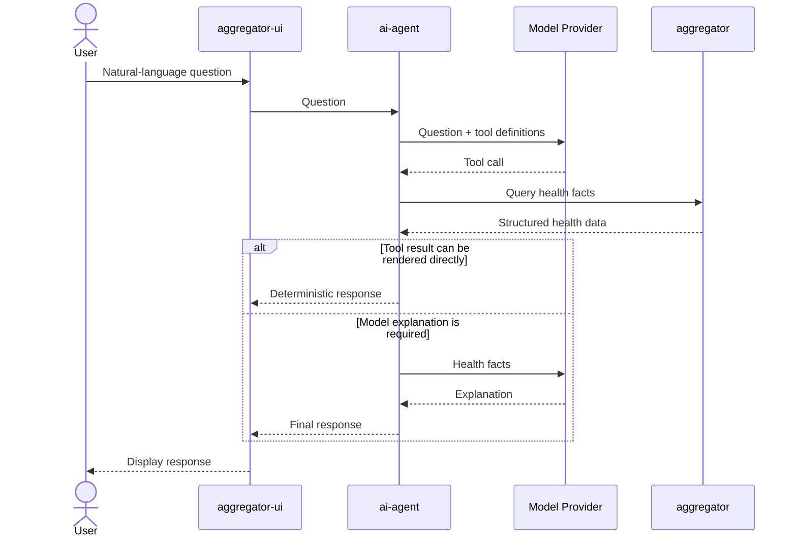
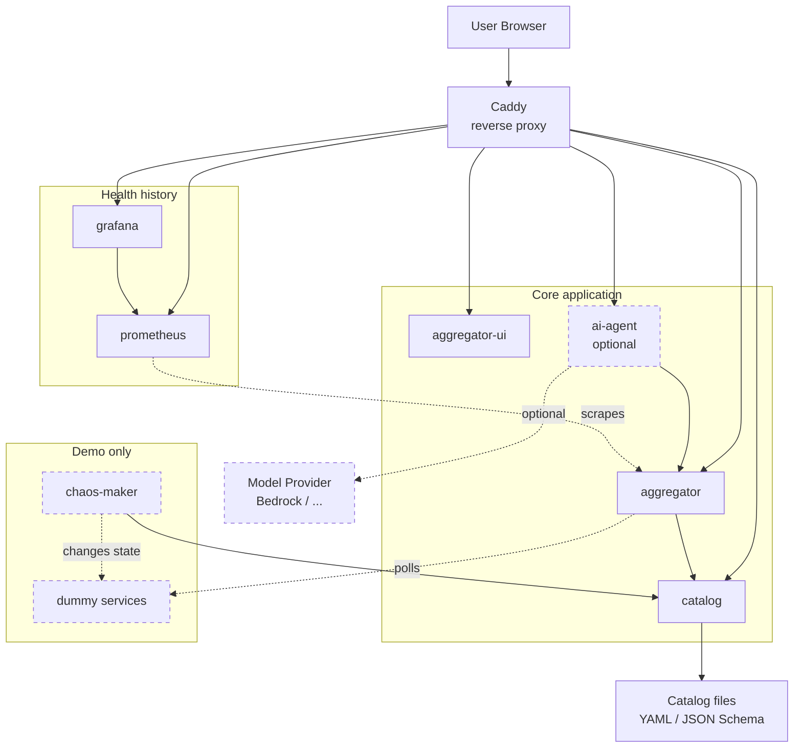

# Services and architecture

Detailed architecture views for Catalog Health Aggregator. Service locations and short descriptions are kept in the main README.

## Health data flow

This view shows how the deterministic health state is built and exposed.
The `aggregator` combines catalog data with health signals, then publishes the
same state through REST and exported metrics. The `aggregator-ui` uses the REST
API to provide the user-facing interface, while the optional `ai-agent` uses the
same API for health questions.

## AI-assisted investigation flow

This sequence shows how a user question moves through the optional AI path.
The `aggregator-ui` sends the question to `ai-agent`, the model selects which
health data is needed, and `ai-agent` retrieves the deterministic facts
from `aggregator`. The result is either rendered directly or sent back to the
model for explanation. The model does not calculate health.

## Detailed service topology

This is the runtime topology of the demo stack. Caddy is the entry point.
The user-facing web interface is provided by `aggregator-ui`, while `catalog`
serves the file-backed catalog definitions, `aggregator` calculates item health, and the optional `ai-agent` handles
natural-language health questions.

Item health history is stored in `prometheus` and visualized by
`grafana` in dashboards embedded by `aggregator-ui`. The demo-only
`chaos-maker` changes the state of the dummy services so the demo continuously
produces changing health data.

